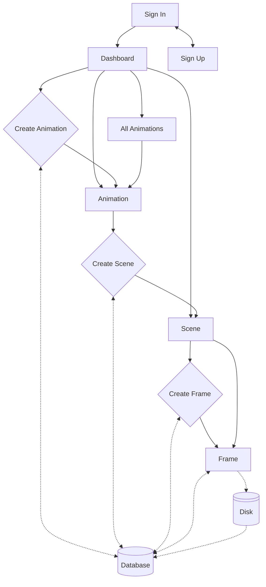
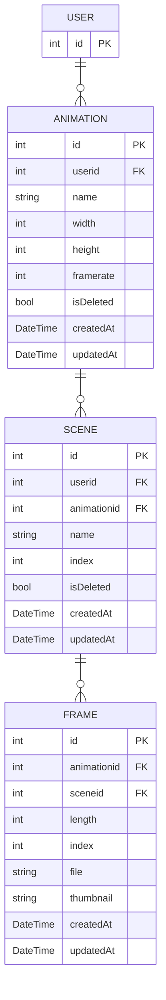
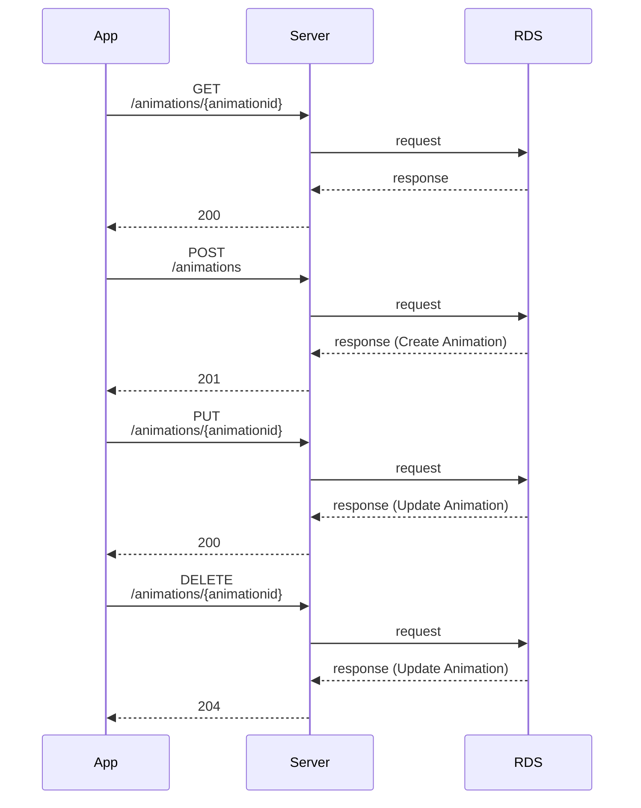
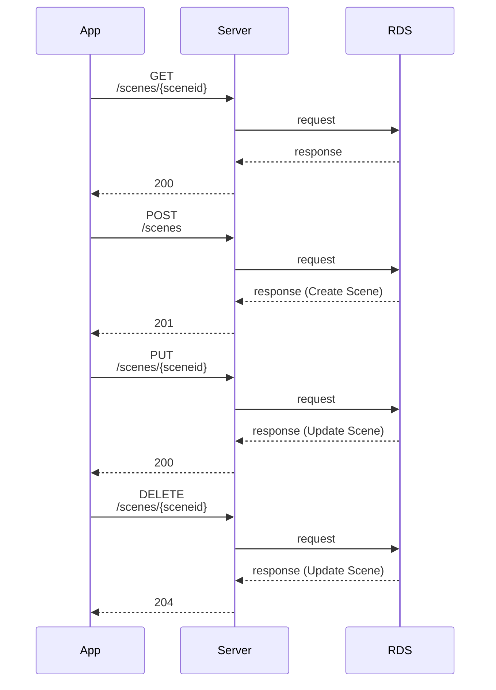
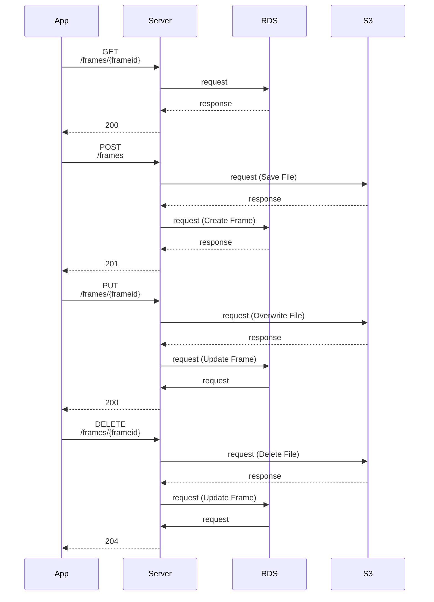

# Skidoodle

## Overview

Problem: Software for creating animation tends to be offline, while those online are limited.

Problem: Modern animation with perfectly drawn lines have lost much of their character given by the imperfection of hand-drawn animation. Bitmap based animation has the potential to combine the character of hand-drawn animation with the ease of digital production.

Solution: Skidoodle aims to be a feature rich online bitmap based animation tool. It should provide users with the ability to create and arrange complex animations built from Scenes; Scenes which are composed of Frames created using a HTML Canvas element. Being bitmap based the user will use brush tools to sketch, paint, and to erase.

## Priorities

### Must have

1. Must have Authentication
2. Must have a method to create new Animation
3. Must have interactive canvas to draw frames
4. Must have basic draw and erase tools
5. Must have a method to export complete animation

### Should have

1. Should have Authorisation
2. Should have a method to save Frames
3. Should have a method to create Scenes
4. Should have frame tools, e.g. setting frame length, duplicate, reorder
5. Should have basic draw settings, e.g. size, color

### Could have

1. Could have Onion Skinning
2. Could have real-time collaboration
3. Could have background layer
4. Could have animation layers
5. Could have rough draft layer
6. Could have animation preview
7. Could have ability to undo/redo
8. Could have a lazy brush

### Won't have

1. Won't have advanced drawing tools, e.g. vector graphics
2. Won't have object based animation with keyframing
3. Won't have a social media aspect

## Glossary

### Animation

A collection of scenes.

### Scene

A collection of frames.

### Frame

A drawing representing a number of video frames.

### Onion Skinning

Being able to see previous and next frames to help with drawing current frame, like tracing in the real world.

### Frame Length (Ones, Twos, Threes...)

The number of video frames that the current frame will be held for.

## Progress

### Pre-ramble

1. [x] Think of catchy name
2. [x] Git initialisation
3. [ ] AWS - Set up:
   - [x] Account
   - [ ] Roles
   - [ ] EC2
   - [ ] RDS
   - [ ] Cognito
4. [ ] Tech Stack - BE
   - [ ] Docker
   - [ ] Nestjs
   - [ ] Prisma
5. [ ] Tech Stack - FE
   - [ ] Docker
   - [ ] Vite (ESLint, Prettier, Jest)
   - [ ] Typescript
   - [ ] React 19
   - [ ] @Tanstack Routing/Query
   - [ ] react-hook-form
   - [ ] Material UI
6. [ ] Docker Compose
7. [ ] Continuous Integration
8. [ ] Initial Database design

### /

1. [ ] Design - Sign In Form
2. [ ] UI - Sign In Form
   - [ ] AWS - Authenticate
3. [ ] UI - Forgot password CTA :triangular_flag_on_post:
4. [ ] AWS - Forgot password :triangular_flag_on_post:
5. [ ] UI - Sign Up CTA

### /sign-up

1. [ ] Design - Sign Up Form
2. [ ] UI - Sign Up Form
3. [ ] AWS - Sign Up integration

### /dashboard

1. [ ] Design - Dashboard
2. [ ] UI - Most recent Animations
3. [ ] UI - Most recent Scenes
4. [ ] UI - All Animations (paginated)
   - [ ] Sort by :triangular_flag_on_post:
5. [ ] UI - Create Animation (Modal)
6. [ ] BE - Request Data
   - [ ] GET Recent Animations
   - [ ] GET Recent Scenes
   - [ ] GET All animations (paginated)

### /animations

1. [ ] Design - Animations
2. [ ] Data - Design Animation Type
3. [ ] UI - Most Recent Animations
4. [ ] UI - List All Animations
5. [ ] UI - Create Animation (Modal)
   - [ ] BE - Create Animation

### /animations/{id}

1. [ ] Design - Animation
2. [ ] UI - Most Recent Scenes
3. [ ] UI - List All Scenes
4. [ ] UI - Create Scene (Modal)
   - [ ] BE - Create Scene
5. [ ] UI - Animation Settings
   - [ ] BE - Update Animation Settings
6. [ ] UI - Export :triangular_flag_on_post:
   - [ ] BE - Generate video file/stills

### /scenes/{id}

1. [ ] Design - Scene
2. [ ] Data - Design Scene Type
3. [ ] Data - Design Frame Type
4. [ ] UI - Create Frame (Modal)
5. [ ] UI - Frame Reordering
6. [ ] UI - Drawing Interface
   - [ ] UI - Canvas
   - [ ] UI - Draw
   - [ ] UI - Erase
   - [ ] UI - Canvas Background :triangular_flag_on_post:
   - [ ] UI - Onion Skinning :triangular_flag_on_post:
   - [ ] UI - Undo/Redo :triangular_flag_on_post:
7. [ ] UI - Timeline
   - [ ] UI - Resize Timeline :triangular_flag_on_post:
8. [ ] UI - Frames
   - [ ] UI - Create Frame CTA
   - [ ] BE - POST Create Frame
   - [ ] Settings :triangular_flag_on_post:
     - [ ] BE - PUT Update Animation Settings :triangular_flag_on_post:
   - [ ] UI - Resize Frames :triangular_flag_on_post:
9. [ ] UI - Controls
   - [ ] BE - PUT Update Current Frame
   - [ ] Playback :triangular_flag_on_post:
10. [ ] UI - Export :triangular_flag_on_post:
    - [ ] BE - Generate video file/stills

### Miscellaneous

1. [ ] DevOps - Continuous Deployment
2. [ ] DevOps - Cron Job - find deleted files based on isDeleted/updatedAt and remove files :triangular_flag_on_post:
3. [ ] DevOps - Logging :triangular_flag_on_post:

:triangular_flag_on_post: Stretch Goals

## FE App structure

## Entity Relationships

The App only contains 4 tables with one of those being controlled by AWS Cognito for the users.

## Sequences

### Animation

### Scene

### Frames

