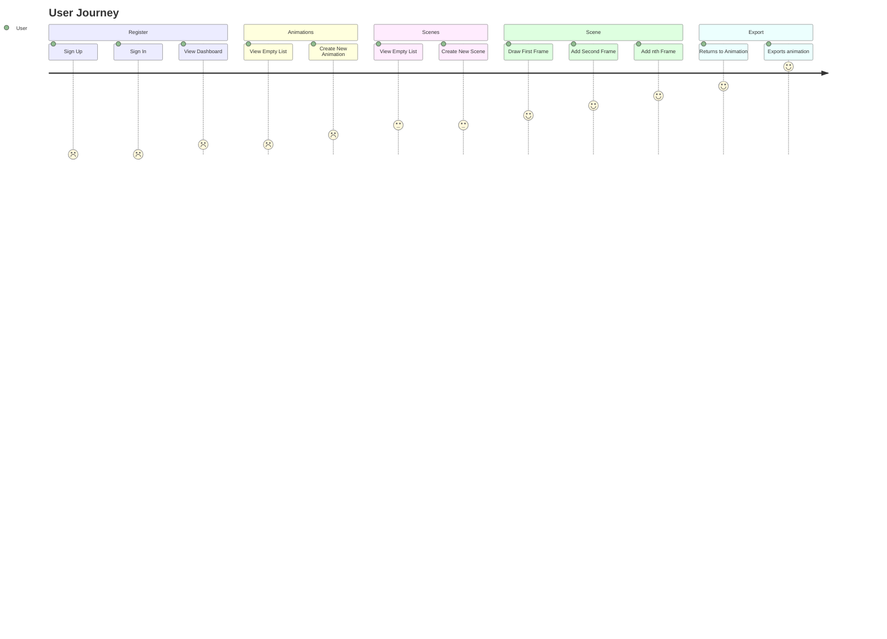
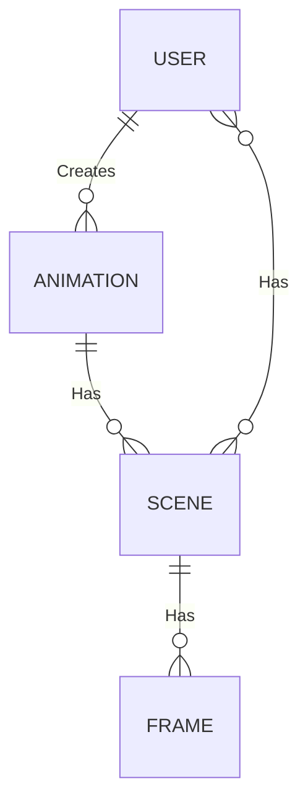
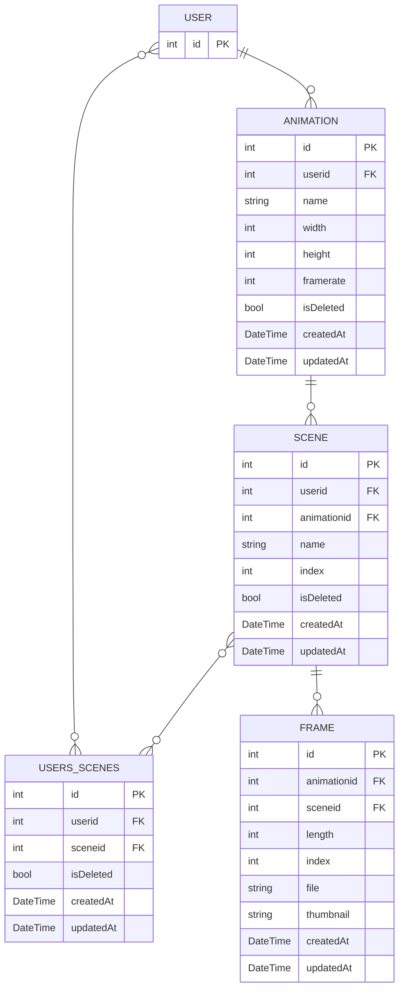

# Skidoodle

## Overview

Problem: Software for creating animation tends to be offline, while those online are limited.

Problem: Modern animation with perfectly drawn lines have lost much of their character given by the imperfection of hand-drawn animation. Bitmap based animation has the potential to combine the character of hand-drawn animation with the ease of digital production.

Solution: Skidoodle aims to be a feature rich online bitmap based animation tool. It should provide users with the ability to create and arrange complex animations built from Scenes; Scenes which are composed of Frames created using a HTML Canvas element. Being bitmap based the user will use brush tools to sketch, paint, and to erase.

### Persona

- **Description**: College Student & Hobbyist Animator
- **Goals**: Create short, fun animations with or without friends for social media, and learn animation basics without a steep learning curve.
- **Pain Points**: Finds complex tools like After Effects overwhelming, wants to avoid subscription costs, and wants a browser based lightweight app that runs on a basic laptop.
- **Tech Habits**: Uses free tools like GIMP or Paint.NET, shares animations on social media, and prefers simple interfaces.
- **Persona Use Case**: User needs a bitmap animation tool with an easy timeline editor, pre-made brushes, and easy export to quickly post online.

### User Journeys

## Priorities

### Must have

1. Must have Authentication
2. Must have a method to create new Animation
3. Must have interactive canvas to draw frames
4. Must have basic draw and erase tools
5. Must have a method to export completed animation

### Should have

1. Should have Authorisation
2. Should have a method to save Frames
3. Should have a method to create Scenes
4. Should have frame tools, e.g. setting frame length, duplicate, reorder
5. Should have basic draw settings, e.g. size, color

### Could have

1. Could have Onion Skinning
2. Could have real-time collaboration
3. Could have background layer
4. Could have animation layers
5. Could have rough draft layer
6. Could have animation preview
7. Could have ability to undo/redo
8. Could have a lazy brush

### Won't have

1. Won't have advanced drawing tools, e.g. vector graphics
2. Won't have object based animation with keyframing
3. Won't have a social media aspect

## Domain Model Diagram

## Entity Relationship Diagram

